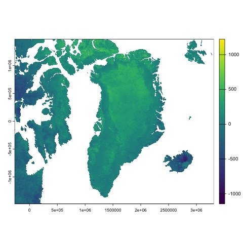

# Reporting multitemporal analysis in R

First of all, we should import an image by:

``` r
im.list() # make a list
gr = im.import("greenland") # to import an image
``` 
Then, we might calculate the difference of value of two images

``` r
grdif = gr[[4]] - gr[[1]]
```

this will create the following image:



> Note 1: information about the copernicus program can be found at https://www.copernicus.eu/en
> Here are the [Sentinel data used](https://www.copernicus.eu/en)

